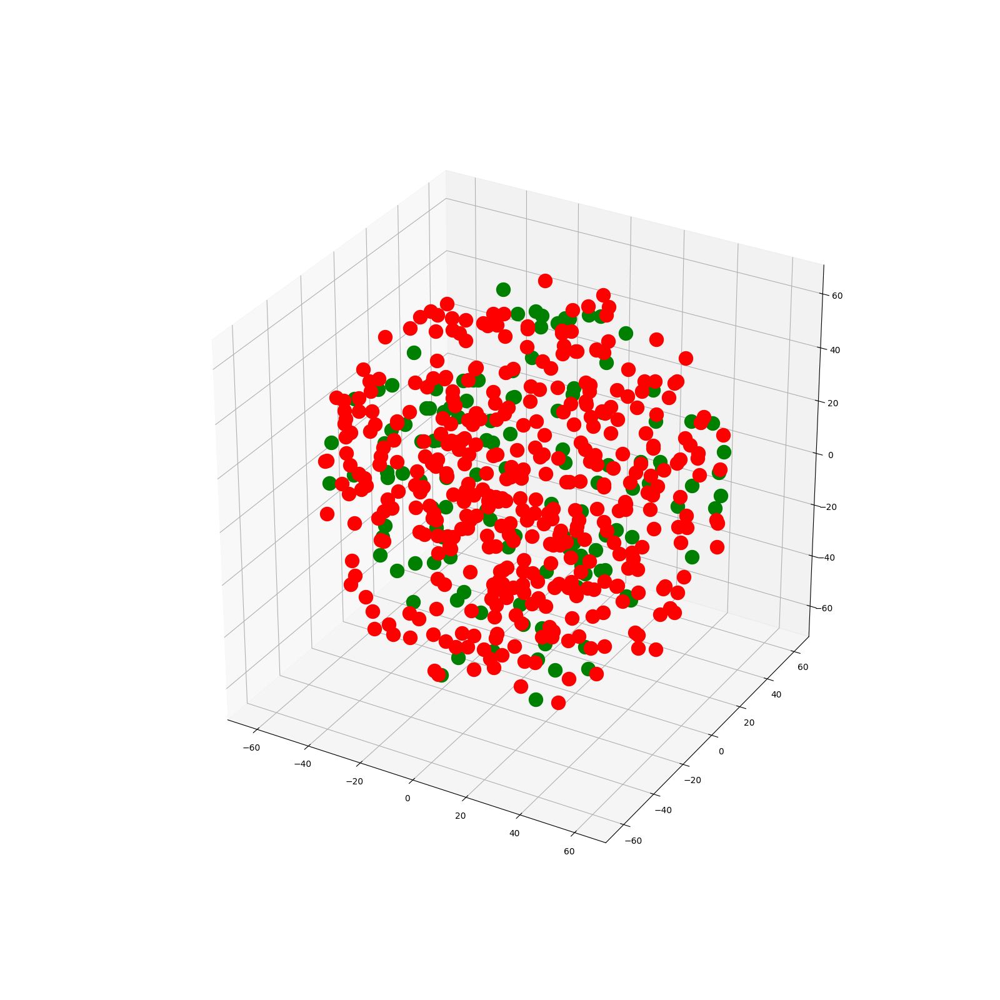
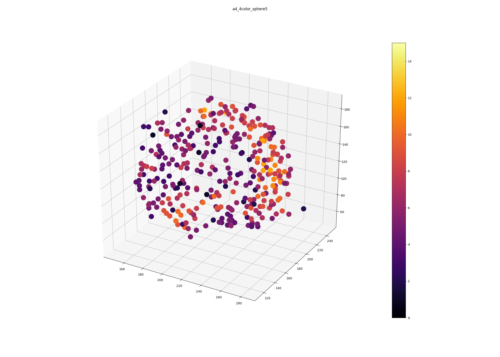
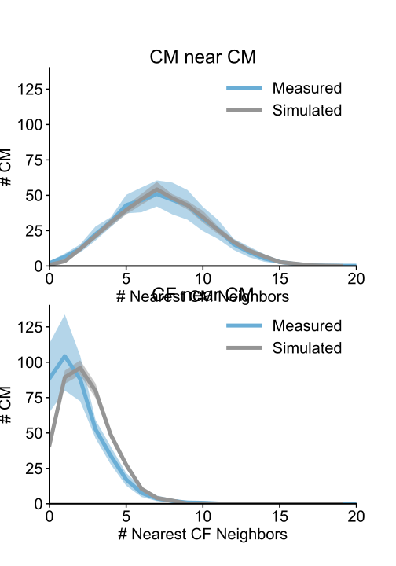
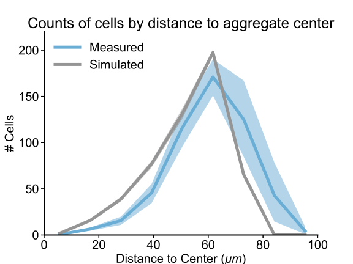

# Single cell determination of engineered cardiac microtissue structure and function

Analysis code for "Single cell determination of engineered cardiac microtissue
structure/function using light sheet microscopy"

## Installing

This script requires Python 3.7 or greater and several additional python packages.
This code has been tested on OS X 10.15 and Ubuntu 18.04, but may work with minor
modification on other systems.

It is recommended to install and test the code in a virtual environment for
maximum reproducibility:

```{bash}
# Create the virtual environment
python3 -m venv ~/cms_env
source ~/cms_env/bin/activate
```

All commands below assume that `python3` and `pip3` refer to the binaries installed in
the virtual environment. Commands are executed from the base of the git repository
unless otherwise specified.

```{bash}
pip3 install --upgrade pip
# Install the required packages
pip3 install -r requirements.txt

# Build and install all files in the CM microtissue structure toolbox
python3 setup.py install
```

The `cm_microtissue_struct` package can also be installed as a python package:

```{bash}
python3 setup.py bdist_wheel
pip3 install dist/cm_microtissue_struct-*.whl
```

After installation, the following scripts will be available:

* `simulate_3d_aggregate_mixing.py`: Simulate randomly mixed 3D aggregates
* `analyze_3d_aggregate_mixing.py`: Analyze empirical or simulated 3D mixing studies
* `stats_3d_aggregate_mixing.py`: Fit distribution curves to simulated or empirical data

The scripts can also be used in an in-place install. First build all extensions
in-place:

```{bash}
python3 setup.py build_ext --inplace
```

Then run each script from the `scripts` directory, e.g.

```{bash}
cd scripts
./simulate_3d_aggregate_mixing.py
```

The examples below assume the scripts are being run with this method.

## Simulating aggregate distributions

Simulated cell coordinates for mixed aggregates can be generated using the
`simulate_3d_aggregate_mixing.py` script. To generate the distribution used in
the paper:

```{bash}
./simulate_3d_aggregate_mixing.py \
    --num-red 400 \
    --num-green 127 \
    --aggregate-radius 75.3 \
    --neighbor-radius 20 \
    --same-cell-radius 5 \
    --num-batches 16 \
    ./data/sim_uniform_pos
```

Which will generate a set of position tables at `./data/sim_uniform_pos` corresponding
to the cell numbers and aggregate radius listed above.



A list of command line arguments is given in the online help:

```{bash}
./simulate_3d_aggregate_mixing.py -h
```

Details and additional simulation parameters are listed in the `simulation` module
documentation.

## Analyzing aggregate distributions

Both simulated and empirical cell position distributions can be analyzed using
the `analyze_3d_aggregate_mixing.py` to generate high level descriptors of the
cell and neighborhood distribution on a per-aggregate basis.

To analyze the example empirical aggregate data:

```{bash}
./analyze_3d_aggregate_mixing.py \
      --plot-point-cloud \
      --group-type split_label \
      ../data/empirical_pos
```

To analyze simulated aggregate data:

```{bash}
./analyze_3d_aggregate_mixing.py \
      --group-type double_green \
      --plot-point-cloud \
      ../data/sim_uniform_pos
```

This analysis generates the individual aggregate quantification in **Figure 2**



A list of command line arguments is given in the online help:

```{bash}
./analyze_3d_aggregate_mixing.py -h
```

Details and additional format parameters are listed in the `aggregate` module
documentation.

## Collecting statistics over aggregate distributions

After running `analyze_3d_aggregate_mixing.py` to calculate individual aggregate stats,
the `stats_3d_aggregate_mixing.py` script can be used to generate overall distributions
of cells within each aggregate.

To compare the example empirical data to the example simulated data, first run
`analyze_3d_aggregate_mixing.py` for both samples as described above, then run:

```{bash}
./stats_3d_aggregate_mixing.py \
      ./data/empirical_pos \
      ./data/sim_uniform_pos
```

This command generates the final distributions in **Figure 2**



As well as the distribution from **Figure S3**



A list of command line arguments is given in the online help:

```{bash}
./stats_3d_aggregate_mixing.py -h
```

Details and additional plotting parameters are listed in the `stats` module
documentation.

## Testing

The modules defined in `cm_microtissue_struct` have a test suite that can be run
using the `pytest` package.

```{bash}
python3 -m pytest tests
```

It is required to first build all extensions using

```{bash}
python3 setup.py build_ext --inplace
```

before running the test suite.

## Documentation

Documentation for the scripts and individual modules can be built using the
`sphinx` package.

```{bash}
cd docs
make html
```

Documentation will then be available under `docs/_build/html/index.html`
